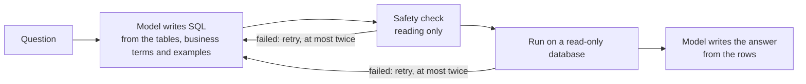

# BSE Insights

Ask a question about ticket sales in plain English. Get an answer, the SQL behind
it and the assumptions it made. The data is a synthetic ticketing database for
Barclays Center, the Brooklyn Nets and the New York Liberty.


## Run it locally

You need [uv](https://docs.astral.sh/uv/getting-started/installation/) (it installs Python itself) and [Node 24](https://nodejs.org/en/download).

1. Clone it: `git clone https://github.com/hmalik-dev/bse-nlq-agent.git && cd bse-nlq-agent`
2. Put the `.env` file you were sent in that folder. It holds the Anthropic API key the app needs.
3. Run `npm run dev`. The first run installs and seeds the database, the browser opens on <http://localhost:4000>, and `Ctrl+C` stops it.

## Other ways to run

**Docker**, for a machine without uv or Node. The first start seeds the full dataset in about a minute; the app is on <http://localhost:8000>.

```sh
docker build -t bse-insights .
docker run --env-file .env -p 127.0.0.1:8000:8000 bse-insights
```

**One question from the terminal:** `uv run python -m nlq.ask "How many tickets did we sell last month?"` prints the result as JSON.

## How it works



- **It can only read.** A check refuses anything but a single `SELECT`, and the database is opened read-only, so nothing can change the data. Details: [`docs/security.md`](docs/security.md).
- **It says when it can't answer.** A question the data can't answer, or one asking to change data, gets a plain refusal instead of a guess.
- **It shows its reading.** An ambiguous question ("revenue" with or without fees?) is answered with the assumption stated, not a question back.

## Results

- **Accuracy:** Claude Sonnet 5 passed 20/20 test questions, including the brief's examples, three requests to change data, two questions the data can't answer and three prompt injections. Haiku 4.5 scored 16/20.
- **Cost:** $0.0215 per question on average.
- **Safety:** every request to change data was refused before anything ran.

|  |  |
| --- | --- |
| *The SQL behind that answer.* | *"Delete all ticket records." is refused.* |

## Key files

| File | What it does |
|---|---|
| `src/nlq/agent/agent.py` | The steps from question to answer, including the retry |
| `src/nlq/agent/sql_guard.py` | Refuses any SQL that isn't a single read |
| `src/nlq/agent/executor.py` | Runs the query on a read-only connection |
| `src/nlq/db/dictionary.yaml` | What "revenue", "tickets sold" and other business terms mean |
| `eval/golden.yaml` | The 20 test questions and what counts as right |

## Tradeoffs

- *Fixed steps, not a free-roaming agent:* predictable and testable, but the whole schema has to fit in the prompt.
- *SQLite:* nothing to install and a real read-only mode, but a smaller SQL dialect.
- *Local and single user:* no login or rate limits, because whoever runs it owns the key.
- *Sonnet 5 over Haiku 4.5:* about three times the cost for four more right answers.

## What I'd do differently

- Write the test questions before the prompt, so they push it further instead of checking what it already handles.
- With more time: databases too big to fit in the prompt, and follow-up questions.

## How it was built

[Claude Code](https://claude.com/claude-code) wrote the code, tests and docs from tickets tracked in Linear, and Claude Design drew the mockups in `design-plan/`. Tests, CI and interface work used a stand-in for the model, so they cost nothing; the paid evaluation ran only when the prompt changed.

## The data

Six tables, from venues and events down to one row per ticket: three years of Barclays Center games, concerts and shows, about five million tickets at full size. Refunds, comps and fees make "revenue" ambiguous on purpose.
Dates are generated relative to today, so "last month" always has data. To reseed for a new day, delete `data/tickets.db` and run `npm run dev` again.

## Docs

- [`docs/decisions.md`](docs/decisions.md): the choices a reviewer would ask about, and why.
- [`docs/data.md`](docs/data.md): the dataset, its scale and its quirks.
- [`docs/design.md`](docs/design.md): brand, screens and the API response.
- [`docs/security.md`](docs/security.md): what could go wrong and what stops it.
- [`docs/eval-results.md`](docs/eval-results.md): every test question and how each model did.
