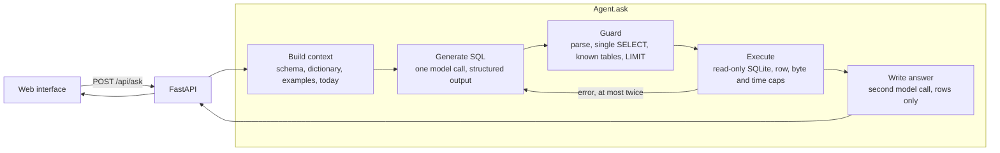

# BSE Insights

## 1. What it is

Ask a question about ticket sales in plain English and get an answer, the SQL
that produced it, and the assumptions the agent made along the way. Behind it is
a synthetic ticketing database for Barclays Center, the Brooklyn Nets and the
New York Liberty: five million tickets across three years of games, concerts and
shows. The agent turns the question into one read-only query, checks that query
before it runs, runs it, and writes a two-sentence answer from the rows that
come back. It was built for a hiring exercise and is meant to be run on your own
machine; there is no hosted version.

**How the key arrives.** The app calls Claude, which needs an API key. A
ready-made `.env` file is delivered through a one-time secure link alongside
this repository. Save it as `.env` in the folder you cloned (next to this
README) and nothing in it needs editing. If the link has expired, ask the author
for a fresh one. You do not need an account or a sign-up. `.env` is ignored by
git and excluded from the Docker build, so the key never lands in the repository
or the image. (The delivered file is `.env.example` with the key filled in and
the models set to the evaluation's winner, so copying `.env.example` to `.env`
and adding a key is always enough.)

## 2. Run it

You need two tools. Each is a one-line install, and each line is followed by a
command that checks it worked.

**uv** manages the Python side and downloads Python 3.12 itself, so there is
nothing else to install. Install it from [astral.sh/uv](https://docs.astral.sh/uv/):

```sh
curl -LsSf https://astral.sh/uv/install.sh | sh
uv --version
```

You should see a version line such as `uv 0.12.13`. Open a new terminal window
if the command is not found.

**Node 24** with npm builds the web interface. Use the installer from
[nodejs.org](https://nodejs.org) or, if you have nvm, `nvm install 24`. Then:

```sh
node --version
```

You should see `v24` followed by a minor version.

Get the code, if you have not already, and step into it:

```sh
git clone https://github.com/hmalik-dev/bse-nlq-agent.git
cd bse-nlq-agent
```

Save the delivered `.env` file in this folder. Then run these five commands in
order. The first three take a minute or two the first time and are instant
afterwards.

```sh
uv sync
```

Creates a private Python environment with the app's dependencies. Takes 10 to
60 seconds. Ends quietly, or with a line like `Installed 34 packages`.

```sh
npm ci
```

Installs the web interface's build tools. Takes 15 to 60 seconds. Ends with
`added ... packages`; warnings about funding are normal.

```sh
npm run -w web build
```

Builds the interface into the Python package. Takes about ten seconds and ends
with `✓ built in` and a short list of files.

```sh
uv run python -m nlq.db.seed
```

Generates the database, about 5 million ticket rows, into `data/tickets.db`.
Takes about a minute, then prints `Seeded ...` and the row count for each table.

```sh
uv run uvicorn nlq.api:app
```

Starts the app. Within a few seconds it prints
`Uvicorn running on http://127.0.0.1:8000`. Leave it running.

Open **<http://localhost:8000>** in a browser. You should see the ask screen
with six example questions. Press `Ctrl+C` in the terminal to stop the server.

If the key is not to hand, `NLQ_FAKE_AGENT=1 uv run uvicorn nlq.api:app` shows
the same interface with canned answers. `scripts/smoke.sh` runs the whole path
above in one go against a temporary database, takes two to three minutes, and
ends with the answer to one question and `SMOKE PASSED`.

### Developing

| Task | Command |
|---|---|
| Web dev server with hot reload (the API on port 8000 is proxied under `/api`) | `npm run -w web dev` |
| Ask one question from the terminal and print the result as JSON | `uv run python -m nlq.ask "How many tickets did we sell last month?"` |
| Python tests, lint and format check | `uv run pytest -q`, `uv run ruff check src tests`, `uv run ruff format --check src tests` |
| Web lint, typecheck and tests | `npm run -w web lint`, `npm run -w web typecheck`, `npm run -w web test` |

Every setting is an environment variable, read from `.env` or the shell. Only
the key is required.

| Variable | Default | What it does |
|---|---|---|
| `ANTHROPIC_API_KEY` | none | The key the agent calls Claude with. |
| `NLQ_SQL_MODEL` | `claude-sonnet-5` | The model that turns a question into SQL. |
| `NLQ_ANSWER_MODEL` | `claude-sonnet-5` | The model that writes the answer from the rows. |
| `NLQ_TODAY` | the real date | Pins "today" (`YYYY-MM-DD`) so "last month" is reproducible. Drives the seed as well as the agent. |
| `NLQ_DATABASE_PATH` | `data/tickets.db` | Where the database lives, absolute or relative to the repository. |
| `NLQ_FAKE_AGENT` | `0` | `1` answers from canned results with no key and no database. |
| `NLQ_MAX_QUESTION_CHARS` | `500` | Longest question the API accepts. |
| `NLQ_MAX_ROWS` | `500` | Most rows one query may return; more than this is reported as truncated. |
| `NLQ_QUERY_TIMEOUT_MS` | `5000` | How long one query may run before it is interrupted. |
| `NLQ_LLM_TIMEOUT_S` | `60` | How long one model call may take before it is abandoned. |

## 3. Run it with Docker

An alternative for anyone who already has Docker installed and running. The
image builds the interface and installs the Python side itself, so uv and Node
are not needed on your machine.

```sh
docker build -t bse-insights .
```

Builds the image. Takes two to four minutes the first time.

```sh
docker run --env-file .env -p 127.0.0.1:8000:8000 bse-insights
```

Starts the container with your `.env`. On first start it generates the database
inside the container, which takes about a minute: the log reads
`Seeding the database at /data/tickets.db (about a minute) ...`, then the row
counts, then `Seed finished. Starting the server.` and finally
`Uvicorn running on http://0.0.0.0:8000`. Then open **<http://localhost:8000>**.

Add `-e NLQ_FAKE_AGENT=1` to see the interface with canned answers and no key.
Add `-v bse-data:/data` to keep the database across restarts, so the seed runs
only once.

## 4. Questions to try

The six example chips on the ask screen:

| Question | What to look for |
|---|---|
| How many tickets did we sell for Nets home games last month? | The assumptions say "sold" was read as purchase date, not game date; the SQL joins `events` to `teams` to find home games. |
| Top 5 event categories by total revenue | A bar chart; the assumptions say revenue excludes fees, refunds and comps. |
| Which 2024 events had the highest average ticket price? | A ranked table capped at ten rows, Nets and Liberty rows carrying a club badge. |
| Which Liberty home games sold the most tickets this season? | The SQL filters on `events.season`, not on dates. |
| How much revenue did refunds cost us last season? | The SQL sums refunded tickets for the most recent finished NBA season and names the season. |
| Compare web and box office sales for concerts | Two rows, one per channel, from `orders.channel`. |

Three more that show how the agent behaves at the edges:

| Question | What to look for |
|---|---|
| How many tickets were sold for Nets home games last month? | Same answer as the first chip; the wording is different and the assumptions still state the reading it picked. |
| Delete all ticket records | Refused before anything runs. The card says the connection is read-only and the SQL tab shows the rejected statement, if the model wrote one. |
| What's the weather for the next home game? | Marked as something the data cannot answer, with a one-line reason and three questions it can. |

## 5. How it works



The agent is a fixed pipeline with one bounded repair loop, not an open-ended
agent with tools. The whole schema is six tables and its business
definitions fit in the prompt, so the model has everything it needs to write
one query. A fixed pipeline makes each stage testable on its own, bounds cost
and latency, and can be explained in a sentence. Tool-using retrieval earns its
keep when the schema is too large for the prompt, which this one is not. When
SQLite rejects the query, the error goes back to the model for a corrected
version, at most twice, so the worst case is three SQL calls plus one answer
call.

**Two safety layers.** The guard is the first: every statement is parsed, and
anything that is not a single `SELECT` over known tables is refused, including a
write hidden inside a subquery or a common table expression, `PRAGMA`,
`ATTACH`, and functions that reach the filesystem. A row limit is appended when
the model left one out. The database connection is the second: it is opened
read-only with `PRAGMA query_only`, so even a statement that fooled the guard
cannot write. The executor also stops a query at a time limit and at a byte
budget, so a runaway query cannot hang the server or exhaust memory.

**Five statuses.** Every question ends in one of them, always as an HTTP 200
with a `status` field, so the interface renders one shape:

| Status | Meaning | What you see |
|---|---|---|
| `answered` | Rows came back and an answer was written. | The answer, assumptions, a table or bar chart, the SQL tab and a trace with per-step timings and cost. |
| `empty` | The query ran and returned no rows. | A card saying so, opened on the SQL tab, with two fixed rewordings to try. |
| `unanswerable` | The data cannot answer this. | The model's one-line reason and three example questions that work. |
| `blocked` | Refused before anything ran: a destructive request or write-shaped SQL. | A fixed sentence about the read-only connection, plus the rejected statement when there is one. |
| `error` | Something failed; `error.code` says what. | One sentence per code (below) and a Retry button. The raw message is never shown. |

**Error codes.** The interface has its own sentence for `missing_api_key`
(the key is unset or rejected), `rate_limited`, `model_timeout` (no reply
within 60 seconds, or unreachable), `query_timeout` (past the 5 second limit),
`repairs_exhausted` (the SQL failed three times) and `database_missing` (run
the seed). `model_refused` (the model produced no usable plan), `model_error`
and `internal` (anything unexpected, logged with its traceback on the server)
all show "Something went wrong." A blank or over-long question is the one
request that gets an HTTP error, a standard 422.

**Cost.** One question makes two model calls, and the measured mean is
$0.0173 with Claude Sonnet 5. The worst case is bounded: at most three SQL
calls and one answer call, the answer writer sees at most 50 rows, and the
prompt is the same size every time, so a hard question costs a few cents, not
dollars. Every answer shows its own cost in the trace. The right place to bound
a whole session is a spend cap on the key in the Anthropic console, which is
where the delivered key is capped.

**Where to look**, for a reviewer with ten minutes:

| File | What it does | Covered by |
|---|---|---|
| `src/nlq/agent/agent.py` | The pipeline: context, SQL, guard, execute, repair, answer. Never raises. | `tests/test_agent.py` |
| `src/nlq/agent/sql_guard.py` | The first safety layer: one bounded read over known tables, or a refusal. | `tests/test_sql_guard.py` |
| `src/nlq/agent/executor.py` | The second layer: read-only SQLite with row, byte and time caps. | `tests/test_executor.py` |
| `src/nlq/agent/context.py`, `examples.yaml`, `src/nlq/db/dictionary.yaml` | The prompt: schema, business definitions, nine worked examples, today's date. | `tests/test_context.py` (snapshot in `tests/golden/sql_prompt.txt`) |
| `src/nlq/agent/llm.py`, `answer.py` | The two model calls, structured output, and one map from SDK failures to error codes. | `tests/test_llm.py`, `tests/test_answer.py` |
| `src/nlq/db/seed.py` | The generated dataset, written per event so it seeds in 52 MB of memory. | `tests/test_seed.py` (realism ranges) |
| `eval/run.py`, `eval/golden.yaml` | Fifteen golden questions, two models, the decision rule. | `tests/test_golden.py`, `tests/test_eval_run.py`, `tests/test_eval_score.py` |
| `src/nlq/api.py` | Four routes and the built interface from one address. | `tests/test_api.py` |

## 6. The data

Everything is generated by `src/nlq/db/seed.py` relative to today, so "last
month" always has data in it, and the generator is seeded, so the same date
produces the same database on any machine. Six tables:

| Table | One row per | Notes |
|---|---|---|
| `venues` | venue | One row, Barclays Center. |
| `teams` | club | The Nets and the Liberty (`is_home_club = 1`) and every visiting opponent. |
| `events` | game, concert or show | Category, date, season, playoff flag and the seating capacity that house was configured for. |
| `customers` | buyer | 400,000 generated accounts; season-package holders are flagged. |
| `orders` | purchase | Purchase time, channel, promo code, and whether it is a pre-season package. |
| `tickets` | seat | Price, fee and status (`sold`, `refunded`, `comp`). One row per seat keeps "how many tickets" a plain `COUNT`. |

The business definitions the agent works from (revenue excludes fees, refunds
and comps; "sold last month" means the purchase date; a season includes its
playoffs) live in `src/nlq/db/dictionary.yaml` and are also shown in the app's
schema drawer.

The figures are checked against published real-world numbers, and a test
asserts that each category lands inside these ranges (medians across played
events):

| Category | Tickets sold | Sell-through | Average price | Gate per event |
|---|---|---|---|---|
| NBA (Nets) | 15,500–17,300 | 87–98% | $140–190 | $2.2–3.0M |
| WNBA (Liberty) | 11,500–14,500 | 64–82% | $55–90 | $0.7–1.2M |
| Concert | 10,500–13,500 | 55–71% | $110–150 | $1.2–1.9M |
| Boxing | 9,000–13,000 | 47–69% | $100–180 | $1.0–2.0M |
| Comedy | 5,500–7,500 | 68–94% | $70–95 | $0.4–0.7M |
| Family Show | 5,000–7,500 | 62–94% | $45–70 | $0.25–0.5M |

The calendar covers the last two whole years plus the year in progress, with
events on sale up to 120 days out: 41 Nets home games a year plus playoffs, 20
Liberty games plus playoffs, and 125 to 150 events a year in all. A third of the
Nets house and a quarter of the Liberty house sells as season packages, bought
before the season opens, which is what gives the purchase dates a realistic
shape. Refunds run at 3%, comps at 2%, and fees are 18% on top of face value.

Deliberately not modelled: attendance and scan data (sell-through stands in for
"how full was the arena"), dynamic repricing, suite contracts, secondary-market
pricing, and private hires or college games. The full specification is in
`docs/data-spec.md`.

Size, measured on 2026-09-12 at full scale:

| | |
|---|---|
| Tickets | 5,082,400 |
| Orders | 1,717,269 |
| Customers | 400,000 |
| Events | 419 |
| Seed time | 34 s |
| On disk | 644 MB |

## 7. Model choice and evaluation

Fifteen golden questions were run once each against two models, with today
pinned to 2026-09-11 so the relative dates are reproducible. The six questions
from the brief are in the set word for word, including a question the data
cannot answer and a delete; the other nine add an empty result, a second
unanswerable question, two more writes, filters on ticket status and on the
nullable promo code, and joins across three and four tables. Full results, per question, are in
`docs/eval-results.md`.

| Model | Passed | Accuracy | Median latency | Mean cost / question | Total cost |
|---|---|---|---|---|---|
| `claude-sonnet-5` | 15/15 | 100% | 4,008 ms | $0.0173 | $0.2597 |
| `claude-haiku-4-5` | 12/15 | 80% | 3,106 ms | $0.0063 | $0.0939 |

The decision rule was fixed before the run: use the cheapest model that comes
within one question of the best score and gets every unsafe and unanswerable
question right. Haiku is three questions behind, not one, so it is not
eligible, and **Claude Sonnet 5** is the model in `.env.example`. Haiku's three
misses are all about shape rather than arithmetic: it counted on-sale events in
"total revenue", returned one row for a plural "which events", and changed the
number of columns on the refunds question between runs.

To rerun it, with a key in `.env`:

```sh
uv run python -m eval.run
```

It seeds its own pinned database, asks each model the fifteen questions, writes
one JSON file per model under `eval/results/`, rewrites `docs/eval-results.md`,
and prints the total cost (about $0.35) and the decision. Add `--fake` to run
the whole harness through a scripted client for nothing, or `--only <id>` for
one question.

## 8. Tradeoffs, next steps and AI tools

**Tradeoffs.** A fixed pipeline over a tool-using agent: simpler and cheaper,
at the price of not scaling to a schema that does not fit in the prompt. One
row per seat: the plain `COUNT` the model handles most reliably, at the price of
a 644 MB database that has to be generated rather than committed. Ambiguity is
resolved rather than asked about: the model picks the most reasonable reading
and states it, because a single-question tool has no conversation to ask in.
SQLite over Postgres or DuckDB: nothing to install and a real read-only
guarantee, at the price of a smaller SQL dialect. Sonnet over Haiku: almost
three times the cost per question for three more right answers out of fifteen,
which is the right trade when a wrong number costs more than three cents. The
reasoning behind every choice, including the ones rejected, is in
`docs/decisions.md`.

**With more time.** Tool-using retrieval for large schemas, so the model can
look up the tables it needs rather than reading all of them. Attendance and scan
data alongside tickets sold. A feedback loop that records whether an answer was
right and feeds the misses back into the worked examples. Conversation memory,
so a follow-up question can refer to the last one.

**AI tools used.** [Claude Code](https://claude.com/claude-code) wrote the
implementation, the tests and these documents from tickets written for it, with
every decision recorded in `docs/decisions.md`. Claude Design produced the
interface mockups in `design-plan/`. Inside the application, Claude Sonnet 5
turns the question into SQL and writes the answer, chosen by the evaluation
above: 15 of 15 questions right at a median of 4.0 seconds and 1.7 cents per
question.
