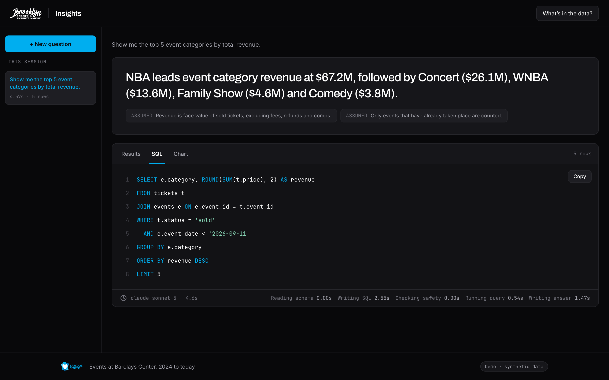
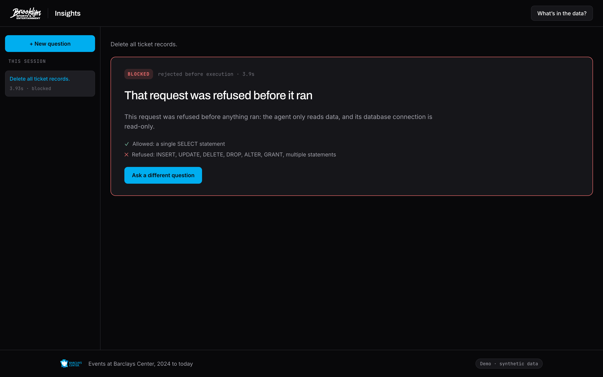
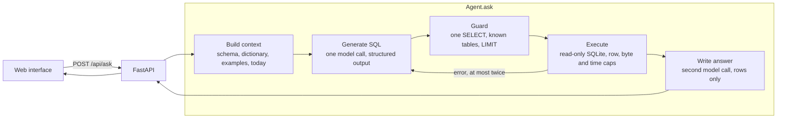

# BSE Insights

Ask a question about ticket sales in plain English. Get an answer, the SQL behind
it and the assumptions it made. The data is a synthetic ticketing database for
Barclays Center, the Brooklyn Nets and the New York Liberty.


## Run it locally

You need [uv](https://docs.astral.sh/uv/) (it installs Python 3.12 itself) and
[Node 24](https://nodejs.org). Save the `.env` file you were sent in the repo
folder, or copy `.env.example` to `.env` and set `ANTHROPIC_API_KEY`.

```sh
git clone https://github.com/hmalik-dev/bse-nlq-agent.git && cd bse-nlq-agent   # get the code
npm run dev                                                                    # install, seed, start, open the app
```

The browser opens on <http://localhost:4000> with six example questions; click
one. The first run installs dependencies and seeds the database; later runs reuse
it (delete `data/tickets.db` to reseed for today). `Ctrl+C` stops everything. Without a key it prints a line and uses the
fake agent, which gives canned answers.

**Without `npm run dev`:**

```sh
uv sync && uv run python -m nlq.db.seed --scale 0.2    # install, then seed a fifth of the data
npm ci && npm run -w web build                        # build the interface into the package
uv run uvicorn nlq.api:app                            # serve UI and API on http://localhost:8000
```

**From the terminal:** `uv run python -m nlq.ask "How many tickets did we sell last month?"`
prints the full result as JSON.

**With Docker:** the first start seeds the full dataset in about a minute.

```sh
docker build -t bse-insights .
docker run --env-file .env -p 127.0.0.1:8000:8000 bse-insights
```

`scripts/smoke.sh` checks the local path end to end and ends with `SMOKE PASSED`.

**Hosted:** <https://bse-insights.fly.dev> is the same app for a first look, on synthetic
data with a spend-capped key; run it locally to exercise it fully. Hosting is Fly, one machine,
one volume; `scripts/deploy.sh` redeploys with a dedicated, capped `ANTHROPIC_API_KEY` that the operator exports.

## Results

- **Accuracy:** Claude Sonnet 5 passed 20/20 golden questions. They include the
  brief's examples word for word, three writes, two unanswerable questions and
  three prompt injections.
- **Cost:** $0.0212 per question on average, with a median latency of 3,899 ms.
- **Safety:** a SQL guard in front of a read-only connection. Nothing the model
  writes can change the data.

|  |  |
| --- | --- |
| *The SQL behind that answer.* | *"Delete all ticket records." is refused.* |

## How it works



- **One fixed pipeline, one entry point.** The UI, CLI, evaluation and tests all
  call `Agent.ask(question) -> AskResult`. It never raises.
- **Two safety layers.** The guard refuses anything but one `SELECT` over known
  tables. The connection is opened read-only, so a statement that fools the
  guard still cannot write. Details: [`docs/security.md`](docs/security.md).
- **Five statuses, always HTTP 200:** `answered`, `empty` (no rows), `unanswerable`
  (the data cannot say), `blocked` (refused before it ran) and `error` (with a
  code the UI turns into one sentence). A malformed question gets a 422.
- **Bounded cost.** At most three SQL calls and one answer call per question.
  Every result carries its tokens and dollar cost in `trace`.

| File | What it does |
|---|---|
| `src/nlq/agent/agent.py` | The pipeline and the repair loop |
| `src/nlq/agent/sql_guard.py` | Safety layer one: parse and refuse |
| `src/nlq/agent/executor.py` | Safety layer two: read-only SQLite with caps |
| `src/nlq/agent/context.py`, `src/nlq/db/dictionary.yaml`, `src/nlq/agent/examples.yaml` | The prompt: schema, business terms, worked examples |
| `src/nlq/agent/llm.py`, `src/nlq/agent/answer.py` | The two model calls and the error map |
| `src/nlq/api.py`, `web/` | The HTTP API and the React interface |
| `eval/run.py`, `eval/golden.yaml` | The evaluation and the model decision rule |

## Evaluation

Twenty golden questions ran once each against Sonnet 5 and Haiku 4.5 on
2026-09-12. The rule, fixed first: the cheapest model within one question of the
best score that gets every refusal right. Haiku scored 16/20, so Sonnet 5 is the
default. Per-question results: [`docs/eval-results.md`](docs/eval-results.md).
Rerun with `uv run python -m eval.run` (about $0.58, or free with `--fake`).

## The data

Six tables: `venues`, `teams`, `events`, `customers`, `orders` and `tickets`,
one row per seat. Three calendar years of Barclays Center home games, concerts
and shows, about five million tickets at full scale. It is generated relative to
today, so "last month" always has data. Refunds, comps and fees make "revenue"
and "tickets sold" ambiguous on purpose; `src/nlq/db/dictionary.yaml` defines
them. Ranges and quirks: [`docs/data.md`](docs/data.md).

## Tradeoffs

- *Fixed pipeline over a tool-using agent:* testable and bounded, but it needs
  the schema to fit in the prompt.
- *One row per seat:* "how many tickets" is a plain `COUNT`, at the cost of a
  large database that is generated, not committed.
- *Resolve ambiguity, don't ask:* the model states its reading as assumptions,
  because there is no conversation to ask in.
- *SQLite:* nothing to install and a real read-only guarantee; a smaller dialect.
- *Local, single user:* no auth or rate limit, because the person asking owns the key.
- *Sonnet over Haiku:* about three times the cost for four more right answers.

**What I'd do differently**

- Write the golden questions before the prompt, so they shape it rather than
  confirm it.
- Seed small by default from the first commit.
- Build the interface thinner and later; it took more tickets than the agent.

**With more time:** tool-using retrieval for schemas too big for the prompt, attendance
and scan data, wrong answers fed back as worked examples, and follow-up questions.

**AI tools used.** [Claude Code](https://claude.com/claude-code) wrote the code,
tests and docs from tickets. Claude Design drew the mockups in `design-plan/`.
In the app, Claude Sonnet 5 writes the SQL and the answer.

## Docs

- [`docs/decisions.md`](docs/decisions.md): the choices a reviewer would ask about, and why.
- [`docs/data.md`](docs/data.md): the dataset, its scale, its quirks and the ranges tests assert.
- [`docs/design.md`](docs/design.md): brand rules, tokens, screens, states and the API response.
- [`docs/security.md`](docs/security.md): trust boundaries, controls, tests and accepted risks.
- [`docs/eval-results.md`](docs/eval-results.md): the latest evaluation, generated by `eval/run.py`.

Tickets live in Linear, project [BSE NLQ](https://linear.app/vendor-marketplace/project/bse-nlq-273533ecd95d). Settings are in `.env.example`.
