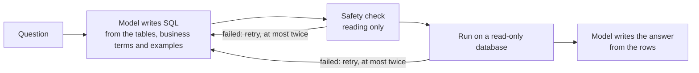

# BSE Insights

Ask a question about ticket sales in plain English. Get an answer, the SQL behind
it and the assumptions it made. The data is a synthetic ticketing database for
Barclays Center, the Brooklyn Nets and the New York Liberty.

## Run it locally

This runs on macOS or Linux. On Windows, use it inside WSL.

### Before you start

Install two tools. You don't need to install Python yourself, because uv downloads the right version on the first run.

- **uv**, which runs the Python side. Install it with `curl -LsSf https://astral.sh/uv/install.sh | sh`, then open a new terminal so your shell can find it. Other ways to install are in the [uv guide](https://docs.astral.sh/uv/getting-started/installation/).
- **Node 24 or newer**, which runs the web interface. Download it from [nodejs.org](https://nodejs.org/en/download), or run `brew install node` on a Mac.

To check both are ready, run `uv --version` and `node --version`. Each should print a version number.

### Steps

1. Clone it: `git clone https://github.com/hmalik-dev/bse-nlq-agent.git && cd bse-nlq-agent`
2. Create a file named `.env` in that folder and paste in the `ANTHROPIC_API_KEY=` line from the link you were sent. The key is real and has a small spending limit, so please try what the app can do rather than sending many repeated questions.
3. Run `npm run dev`. The first run installs everything and seeds the database, the browser opens on <http://localhost:4000>, and `Ctrl+C` stops it.

## How it works

- **Read-only.** A check allows only a single `SELECT`, and the database itself is opened read-only.
- **No guessing.** If the data can't answer a question, or it asks to change data, the app says so. Ambiguous terms like "revenue" are answered with the assumption stated.
- **Errors are answers.** A question the data can't answer, one that returns nothing, a request to change data, and SQL that fails to run each come back as a plain sentence with its own status, never a crash.

The pipeline is in `src/nlq/agent/agent.py`.

## The data

A synthetic ticketing database for Barclays Center, generated on first run so "last month" always has data. It covers the last two calendar years, the year in progress and events on sale up to 120 days out. Six tables in SQLite:

| Table | One row per | Holds |
|---|---|---|
| `events` | game, concert or show | category, date, season, home and away team, seating capacity |
| `tickets` | seat | face price, fee, status: sold, refunded or comp |
| `orders` | purchase | when it was bought, channel, promo code, season-package flag |
| `customers` | buyer | name, city, season-member flag |
| `teams` | team | the Nets, the Liberty and every visiting opponent |
| `venues` | venue | Barclays Center |

The schema is `src/nlq/db/schema.sql`. Every term the model reads is defined in `src/nlq/db/dictionary.yaml`. Scale, calendars and realism checks: [`docs/data.md`](docs/data.md).

## Model selection

Claude Sonnet 5 writes both the SQL and the answer. It was chosen by measurement: each candidate was asked the same 20 test questions, which include the app's example questions, attempts to change data and prompt injections.

- Claude Sonnet 5 passed 20/20 test questions. A question costs $0.0215 on average.
- Haiku 4.5 scored 16/20 at about a third of the cost.

The rule, fixed before the run, was the cheapest model within one question of the best that gets every refusal right. Haiku was four behind, and a wrong number costs more than a cent. Larger models were not tried, because writing SQL over six tables is a reading task rather than a reasoning one. Switching models is one setting. Details: [`docs/eval-results.md`](docs/eval-results.md).

## Tradeoffs

- **SQLite with generated data, not a real warehouse:** nothing to install and a true read-only mode, but a smaller SQL dialect.
- **Local and single user:** no login or rate limits, since whoever runs it supplies the key.
- **Stated assumptions, not follow-up questions:** each question stands on its own.

## With more time

- **Follow-up questions**, so you can refine an answer ("now just the Nets").
- **Bigger databases**, by giving the model only the tables a question needs instead of all of them.
- **Prompt caching** in everyday use, so repeated questions cost less. The evaluation ran without it to keep per-question costs comparable.

## AI tools used

- **Model provider:** Anthropic, through the direct API. Claude Sonnet 5 writes the SQL and the answer inside the app; Haiku 4.5 was evaluated alongside it.
- **Coding assistant:** [Claude Code](https://claude.com/claude-code) wrote the code, tests and docs from tickets tracked in Linear.
- **Design:** Claude Design drew the mockups in `design-plan/`.

## Docs

- [`docs/decisions.md`](docs/decisions.md): the choices a new engineer would ask about, and why.
- [`docs/data.md`](docs/data.md): the dataset, its scale and its quirks.
- [`docs/security.md`](docs/security.md): what could go wrong and what stops it.
- [`docs/design.md`](docs/design.md): brand, screens and the API response.
