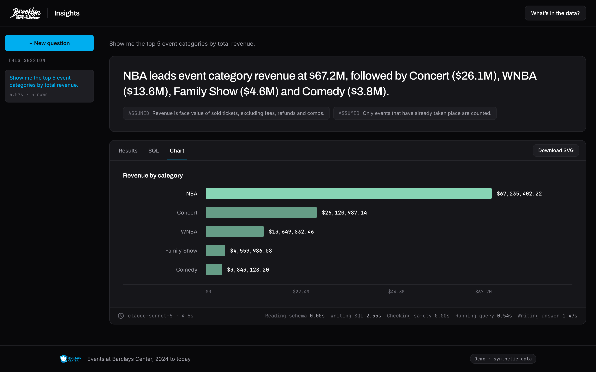
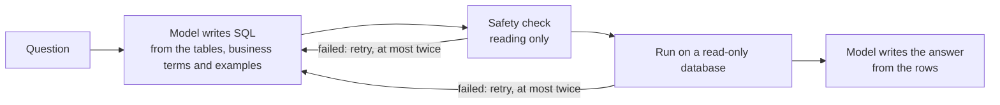

# BSE Insights

Ask a question about ticket sales in plain English. Get an answer, the SQL behind
it and the assumptions it made. The data is a synthetic ticketing database for
Barclays Center, the Brooklyn Nets and the New York Liberty.



## Run it locally

You need [uv](https://docs.astral.sh/uv/getting-started/installation/) (it installs Python itself) and [Node 24](https://nodejs.org/en/download).

1. Clone it: `git clone https://github.com/hmalik-dev/bse-nlq-agent.git && cd bse-nlq-agent`
2. Create a file named `.env` in that folder and paste in the `ANTHROPIC_API_KEY=` line from the link you were sent. The key is real and has a small spending limit, so please try what the app can do rather than sending many repeated questions.
3. Run `npm run dev`. The first run installs and seeds the database, the browser opens on <http://localhost:4000>, and `Ctrl+C` stops it.

## Other ways to run

**Docker**, if you don't have uv or Node. The app is on <http://localhost:8000>.

```sh
docker build -t bse-insights .
docker run --env-file .env -p 127.0.0.1:8000:8000 bse-insights
```

**From the terminal:** `uv run python -m nlq.ask "How many tickets did we sell last month?"`

## Tests

`uv run pytest -q` for the Python side and `npm run -w web test` for the interface. Neither calls the Anthropic API.

## How it works



- **Read-only.** A check allows only a single `SELECT`, and the database itself is opened read-only.
- **No guessing.** If the data can't answer a question, or it asks to change data, the app says so. Ambiguous terms like "revenue" are answered with the assumption stated.

The pipeline is in `src/nlq/agent/agent.py`.

## Results

Claude Sonnet 5 passed 20/20 test questions, including the brief's examples, attempts to change data and prompt injections. Haiku 4.5 scored 16/20. A question costs $0.0215 on average. Details: [`docs/eval-results.md`](docs/eval-results.md).

## Tradeoffs

- **SQLite with generated data, not a real warehouse:** nothing to install and a true read-only mode, but a smaller SQL dialect.
- **Local and single user:** no login or rate limits, since whoever runs it supplies the key.
- **Stated assumptions, not follow-up questions:** each question stands on its own.
- **Sonnet 5 over Haiku 4.5:** more accurate answers at about three times the cost.

## With more time

- **Follow-up questions**, so you can refine an answer ("now just the Nets").
- **Bigger databases**, by giving the model only the tables a question needs instead of all of them.
- **Prompt caching** in everyday use, so repeated questions cost less. The evaluation ran without it to keep per-question costs comparable.

## How it was built

[Claude Code](https://claude.com/claude-code) wrote the code, tests and docs from tickets tracked in Linear; Claude Design drew the mockups in `design-plan/`.

## Docs

- [`docs/decisions.md`](docs/decisions.md): the choices a reviewer would ask about, and why.
- [`docs/data.md`](docs/data.md): the dataset, its scale and its quirks.
- [`docs/security.md`](docs/security.md): what could go wrong and what stops it.
- [`docs/design.md`](docs/design.md): brand, screens and the API response.
